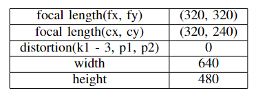

# Localization of TartanAir Dataset using ORB-SLAM3 and GTSAM

This is the repository for WN23 ROB 530 Team 10's Final Project on 'Localization of TartanAir Dataset using ORB-SLAM3 and GTSAM'.  In this project, we used ORB-SLAM3 and factor graph method (iSAM2) in GTSAM library to perform localization on TartanAir dataset. We first pre-process the input images by generating the correct camera setting files for the stereo camera method, where it takes both left and right images as inputs for ORB-SLAM3 trajectory estimation. Subsequently, visual odometry is generated by processing the optical flow files, which are the projects of the three-dimensional image motion of objects relative to a visual sensor onto its image plane, included in the TartanAir dataset. Finally, estimated trajectory from ORB-SLAM3 and odometry are fused by using GTSAM library to generate final localization result.

## Table of Contents
- [Localization of TartanAir Dataset using ORB-SLAM3 and GTSAM](#Localization-of-TartanAir-Dataset-using-ORB-SLAM3-and-GTSAM)
  - [Table of Contents](#table-of-contents)
  - [Background](#background)
    - [Overview](#overview)
    - [Results](#results)
  - [Dependencies](#dependencies)
  - [Install](#install)
  - [Dataset Preparation](#dataset-preparation)
  - [Usage](#usage)
  - [Authors](#authors)
  - [Citation](#citation)
  
## Background

This project focuses on the use of ORB-SLAM3 and incremental smoothing technique (iSAM2) from GTSAM in order to perform localization on the abandoned factory trajectory of TartanAir dataset. To perform this, the images are preprocessed using OpenCV and the sequence is passed onto ORB-SLAM3 to generate an estimated trajectory. To improve robustness and accuracy, the estimated trajectory is passed through smoothing and mapping using visual odometry collected from the dense optical flow, provided by the dataset, through the GTSAM library to generate final localization trajectory.

Please find the introduction video to our project [here](https://www.youtube.com/watch?v=JXXVHaLAXbg)

### Overview

#### 1. TartanAir Dataset

In 'Localization of TartanAir Dataset using ORB-SLAM3 and GTSAM', the main dataset used for the 3D trajectory generation is the abandoned factory P0001 sequence of TartanAir. The downloaded TAR file provides the trajectory with stereo images, left and right depth as well as flow data along the frames for robot navigation tasks taken through a quadcopter drone with the camera intrinsics as mentioned below:

