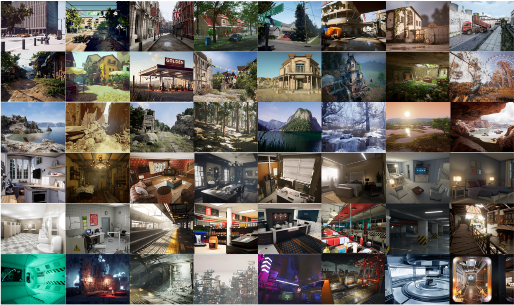
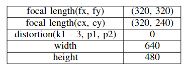
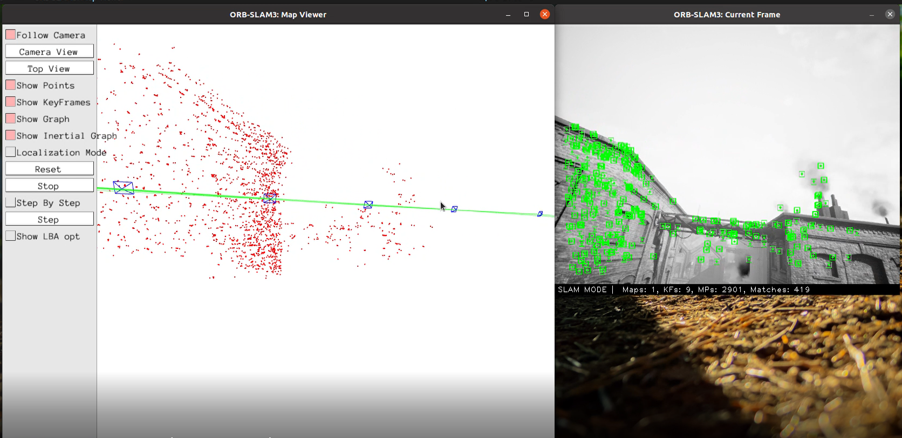
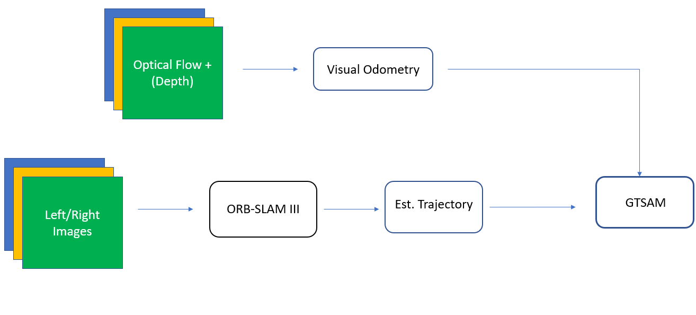
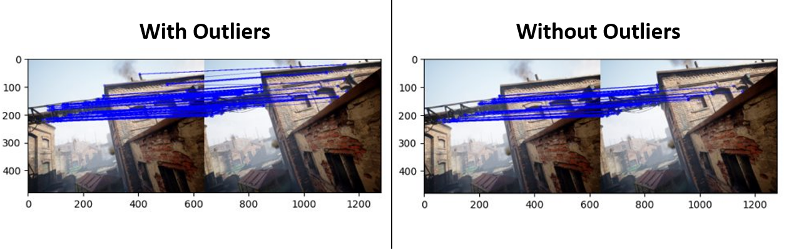

# Localization of TartanAir Dataset using ORB-SLAM3 and GTSAM

This is the repository for WN23 ROB 530 Team 10's Final Project on 'Localization of TartanAir Dataset using ORB-SLAM3 and GTSAM'.  In this project, we used ORB-SLAM3 and factor graph method (iSAM2) in GTSAM library to perform localization on TartanAir dataset. We first pre-process the input images by generating the correct camera setting files for the stereo camera method, where it takes both left and right images as inputs for ORB-SLAM3 trajectory estimation. Subsequently, visual odometry is generated by processing the optical flow files, which are the projects of the three-dimensional image motion of objects relative to a visual sensor onto its image plane, included in the TartanAir dataset. Finally, estimated trajectory from ORB-SLAM3 and odometry are fused by using GTSAM library to generate final localization result.

## Table of Contents
- [Localization of TartanAir Dataset using ORB-SLAM3 and GTSAM](#Localization-of-TartanAir-Dataset-using-ORB-SLAM3-and-GTSAM)
  - [Table of Contents](#table-of-contents)
  - [Background](#background)
    - [Overview](#overview)
    - [Results](#results)
  - [Dependencies](#dependencies)
  - [Dataset Preparation](#dataset-preparation)
  - [Usage](#usage)
  - [Citation](#citation)
  - [Authors](#authors)
  
## Background

This project focuses on the use of ORB-SLAM3 and incremental smoothing technique (iSAM2) from GTSAM in order to perform localization on the abandoned factory trajectory of TartanAir dataset. To perform this, the images are preprocessed using OpenCV and the sequence is passed onto ORB-SLAM3 to generate an estimated trajectory. To improve robustness and accuracy, the estimated trajectory is passed through smoothing and mapping using visual odometry collected from the dense optical flow, provided by the dataset, through the GTSAM library to generate final localization trajectory.

Please find the introduction video to our project [here](https://www.youtube.com/watch?v=JXXVHaLAXbg)

### Overview

#### 1. TartanAir Dataset

In 'Localization of TartanAir Dataset using ORB-SLAM3 and GTSAM', the main dataset used for the 3D trajectory generation is the abandoned factory P0001 sequence of TartanAir. The downloaded TAR file provides the trajectory with stereo images, left and right depth as well as flow data along the frames for robot navigation tasks taken through a quadcopter drone with the camera intrinsics as mentioned below:

#### 2. ORB-SLAM3

For the initial 3D trajectory estimation, ORB-SLAM3 is performed on the dataset using the stereo images. As the sequence of image is passed, a real-time execution of visual, visual-inertial and multi-map SLAM takes place which generates the multi-map system and provides the corresponding poses to be used for optimization through smoothing with GTSAM

#### 3. Pipeline showing Visual Odometry with Optical Flow

For factor-graph optimization using GTSAM, the estimated poses from ORB-SLAM3 are paired with visual odometry generated using optical flow data and depth maps (in some versions) to produce the final localization trajectory.

### Results

The estimated trajectory was generated by running ORB-SLAM3 on the abandoned-factory sequence, which performs feature-based extraction through ORB (Oriented FAST and Rotated BRIEF) and brute-force matching to generate the camera trajectory and multi-map system.  

The estimated trajectory computed through ORB-SLAM3 is possible through the ORB features extracted from each frame and matched by brute force or optical flow method which is assisted by global IDs to mark features in the lifetime of the execution.

#### Feature Matching through the TartanAir Dataset

## Dependencies

### For ORB-SLAM3

In order to run ORB-SLAM3, the following requirements need to be satisfied.
- Ubuntu 16.04 or 18.04
- C++11 or C++0x Compiler
- Pangolin (Download and install instructions [here](https://github.com/stevenlovegrove/Pangolin))
- OpenCV >= 3.0 (Download and install instructions [here](http://opencv.org/))
- Eigen >= 3.1.0 (Download and install instructions [here](http://eigen.tuxfamily.org/))
- DBoW2 and g2o
- Python
- Robot Operating System (ROS) (Optional)

### For Visual Odometry and Graph Optimization

In order to perform 3D trajectory optimization, the following requirements need to be satisfied.

- OpenCV (Download and install instructions [here](http://opencv.org/))
- GTSAM (Download and install instructions [here](https://github.com/borglab/gtsam))

## Dataset Preparation

In order to extract the abandoned factory dataset from TartanAir, the following requirements need to be installed.

- Azure Storage Blob package
- Numpy package

The dataset can be downloaded using the link [here](https://cmu.box.com/s/5ycmyx1q3vumesl0bozfze1a54ejwgmq) or through the provided Python files in [TartanAir Tools](./tartanair_tools) folder.

## Usage

To generate the estimated trajectory, pass the stereo images as input to the ORB-SLAM3 for which more instructions can be found in the [ORB-SLAM3](./ORB_SLAM3) GitHub page.

In order to visualize the attempts for graph-optimization using different methods for visual odometry using optical flow data and depth maps, see the Jupyter Notebook file [here](./OpticalFlow_GTSAM/OF_GTSAM.ipynb)

The different attempts for visual odometry can be seen in the [Estimate Camera Motion](./Estimate_Camera_Motion) which finds the relative motion of the camera with the trajectory of dataset.

## Citation

@article{tartanair2020iros,
  title =   {TartanAir: A Dataset to Push the Limits of Visual SLAM},
  author =  {Wang, Wenshan and Zhu, Delong and Wang, Xiangwei and Hu, Yaoyu and Qiu, Yuheng and Wang, Chen and Hu, Yafei and Kapoor, Ashish and Scherer, Sebastian},
  booktitle = {2020 IEEE/RSJ International Conference on Intelligent Robots and Systems (IROS)},
  year =    {2020}
}

@article{ORBSLAM3_TRO,
      title={{ORB-SLAM3}: An Accurate Open-Source Library for Visual, Visual-Inertial 
               and Multi-Map {SLAM}},
      author={Campos, Carlos AND Elvira, Richard AND G\´omez, Juan J. AND Montiel, 
              Jos\'e M. M. AND Tard\'os, Juan D.},
      journal={IEEE Transactions on Robotics}, 
      volume={37},
      number={6},
      pages={1874-1890},
      year={2021}
     }

@article{VisualOdomOpt,
      title={Leveraging Deep Learning for Visual Odometry Using Optical Flow},
      author={Pandey, Tejas AND Pena, Dexmont AND Byrne,Jonathan AND Moloney, David},
      journal={Sensors (Basel)}, 
      year={2021}
     }

## Authors
Tong Chen, Yuqi Wang, Siyuan Yin, Aravind Krishnakumar, Haodong Jia

